**NETWORKWALKS-B083-WK-4-WEBAPPLICATION PENETRATION TESTING ASSESSMENT**
--

<h2 align="center">Mediroza hospital Penetration Testing Report</h2>

**📌 Project Information**

| 🧩 Component | ⚙️ Detail |
| :--- | :--- |
| Program | cybersecurity Internship at Networkwalks |
| Week | 04|
|Batch |B083|
| 🐉Phases Covered |Phase 1: 👣Reconnaissance & Footprinting  |                	
|           |Phase 2: Scanning & Network Discovery |
|           |Phase 3:⚔️ Penetration Testing |
| 🌐 Target | Medirozahospital |
|Assessment type| Web Application security analysis by Black-box penetration testing|
| 🔐Permission Secured | Yes |
| 🚪 Repository | Git hub |
----------------------------

**1.Liability Desclaimer:**
-----------------

I have performed these activities only on systems and devices where I had secured written permission or on devices/systems that I own myself.

All materials are provided for educational and research purposes only. Do not use anything from this report to break the law.

The instructor, authors, and Networkwalks are not responsible for misuse of the information provided in this report. Every action taken using this knowledge is the user's own responsibility.

Unauthorized access to computer systems can result in criminal charges, financial penalties, loss of employment, and other legal consequences.

📌Project overview
-
This project alligned with Healthcare  Mediroza General Hospital with explicit permission by this organisation .Mediroza General Hospital brings together experienced specialists, modern diagnostics and round-the-clock emergency services under one roof.It has served Johannesburg since 2003.We have permission to check the security of this web application by VAPT .During the Penetration testing it is prohibited to disclose the weakness or Vulnerabilities or any confidential files ,information of the organisation.It is only for learning purpose .We have 4 milestones to complete.
- M1:-Authentication process 
- M2:-Data extraction through pdf locked
- M3:-Confidential Database Information
- M4:-Penetration testing Report

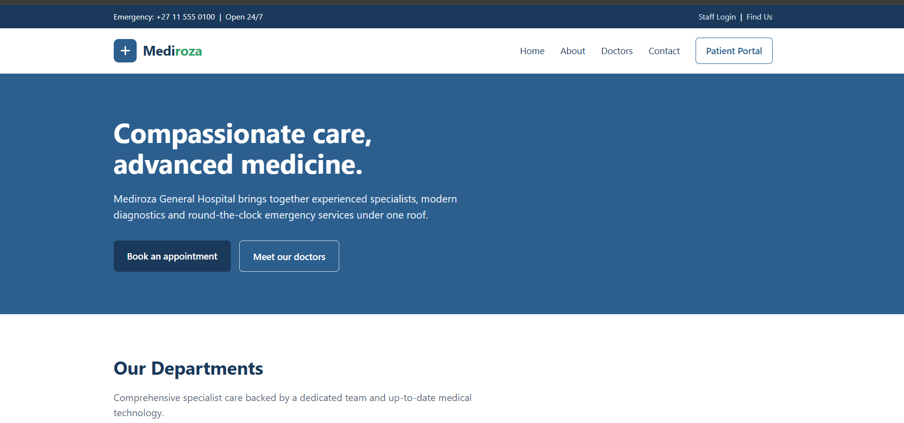

Tools🧰
--
Step 1 :- Go to webservice the interface image is above mentioned

Step 2:-Now go to patient portal .

step 3:-As we have no credential to login lets use SQL based command .The login page returned different responses for invalid usernames and valid usernames with an incorrect password.

This behavior allowed confirmation of whether a username existed.

Step 4 :- Now added another hyper sql command to login
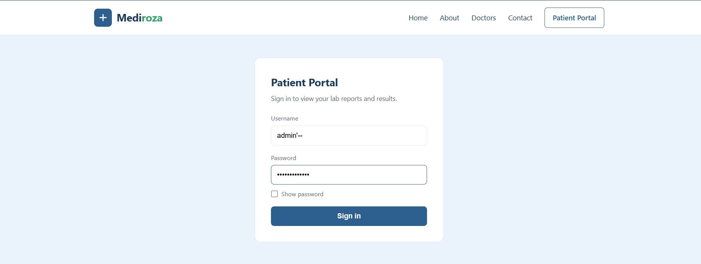
Step 5 :- These are reports of some patients .
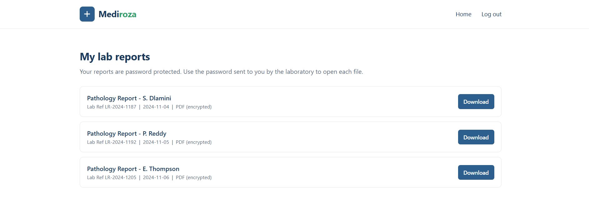
Step 6:- Downloaded it and we will try to open it by carcking password .

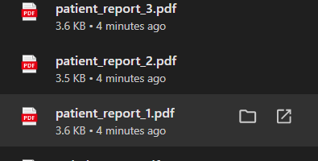

Step 7:- Go to Networkwalks and use these two tools:---
 - Networkwalks Hash-Calculator
- Networkwalks Password Cracker
(a) Opening Hash-calculator then I Uploaded the locked PDF to the Hash Calculator to get the hash lines. The Hash Calculator supports MD5, SHA-1, SHA-256, SHA-384, and SHA-512 or extract a crackable hash from dedicated file .
(b) Then pasted the hash lines in NW password cracker to get password.
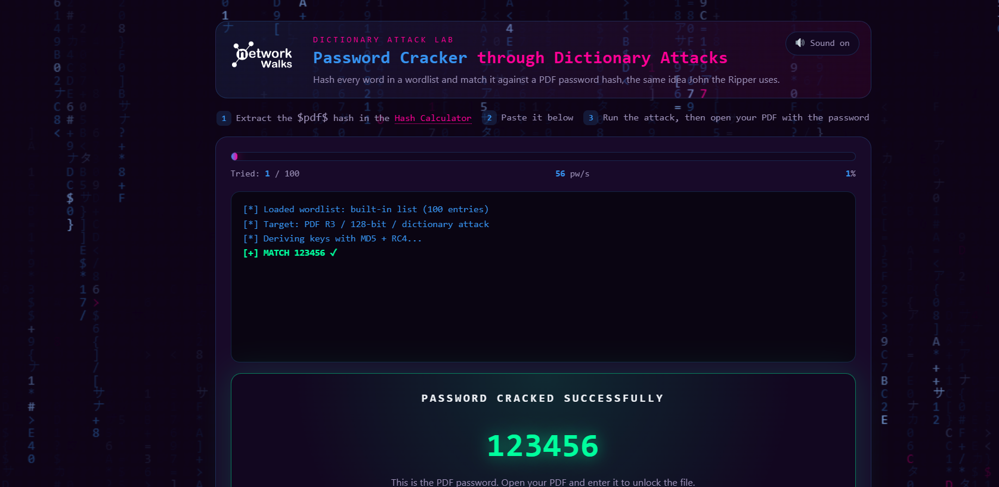
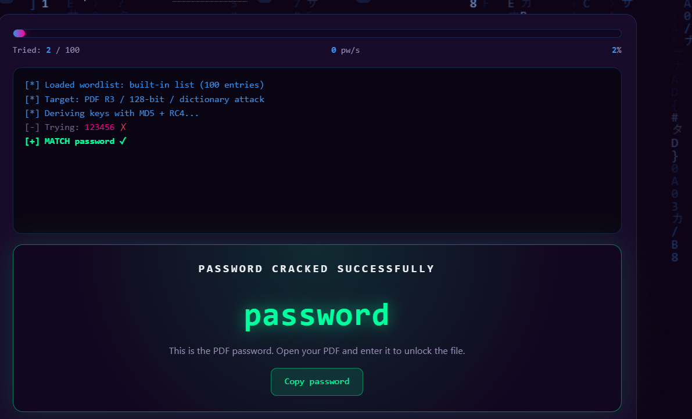

(c)Here i will use Dictonery based attack .
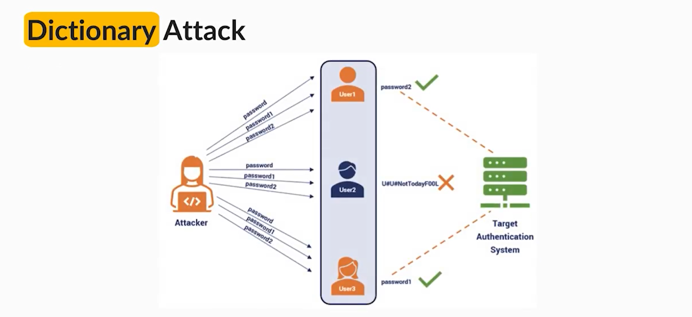

Now i got a  password 

Now unlock the pdf by using this also.
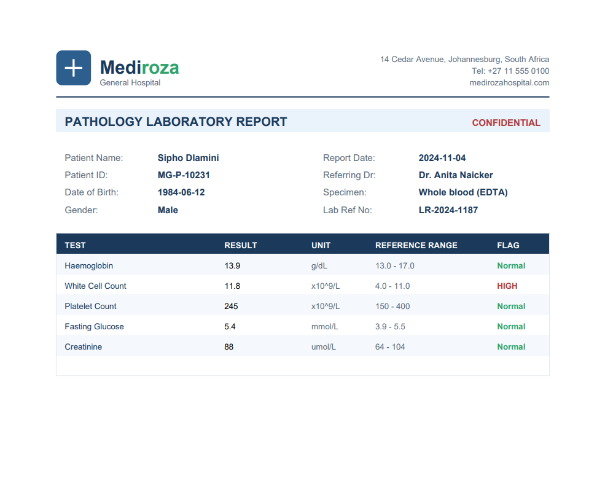

 -------------------------------------
 Now move forward to some tools of kali for information gathering of domain .All commands were performed using Kali Linux for footprinting and a Windows PC with Zenmap installed for network scanning.
Each activity includes:
- Network reconnaissance
- Port scanning 
- Screenshot evidence collected
- Report maintaing
- Security tool experimentation with Zenmap

**3.⚙️Tools used:**
---------------------
| 🧩 Tools |  Aim |                                                                                                           
| :--- | :--- |
| 🖥️ Kali Linux & windows OS | OS used for recognaissance and scanning |
| 🧠 WHOIS |Shows Public available domain registeration details ,date,server name.  |
|  🌐 WHATWEB |  Fingerprint web technologies such as servers, CMS platforms, plugins, and IP information|
| 🧠 Nslookup | Domain name to ip address using DNS |
| ✴️Curl-I  | Inspect HTTP response headers from a website |
| 📡 Wafw00f | Inspect Firewall used in web application |
 | DNSRecon |Enumerate DNS records such as NS, MX, SPF, TXT, and SRV records|
| Zenmap (N-map GUI) |Scan the local subnet to identify live hosts, IP addresses, and MAC addresses |

**4.Activities Performed:**
------------------------------
**4.1 Footprinting & Reconnaissance**
------------------
I have performed footprinting on website medirozahospital.com domain using 6 Kali linux tools:-
- WHOIS
- WhatWeb
- Nslookup
- Curl-I
- Wafw00f
- DNSRecon
Each tools gave different details about the website.
---------------------------------
**WHOIS**
-----
Firstly of all,I used this tool to determine the Publicaly available details of domain like regesteration info.,server name,Date.

**WhatWeb**
------
Secondly I used this to fetch the Tech-service it used .And it gave me result like:-
- Server Type: LiteSpeed
- Redirect: HTTP → HTTPS (301 Moved Permanently)
- Response Codes:
  
              301 (Redirect)

       403 (Forbidden – access denied)

- Headers: x-turbo-charged-by (LiteSpeed optimization)
  
  **Nslokup**
  ----------
  Nslookup resolved domain name into ip address of the web server.

  **Curl**
  -----------
   used Curl with the **-I **option to inspect the HTTP response headers. This might not able to provide me cache details.

  **Wafw00f**
  -------
  It is graphical firewall detector to detect that which firewall is used to protect the website.
  It gave no result about the firewall used in website due to generic scan .
  
  **DNSRecon**
  ------
  Finally, I used DNSRecon to enumerate DNS records. The results provided information related to name servers, mail servers, SPF/TXT records, service records, and DNS software information.
  
  ----------------------------------------------------------------------------------------------------------------------------------------------------------------------------
  👁️‍🗨️ Network Scanning with Zenmap**
  ------
For the second activity, I used Zenmap to perform network discovery on my local network. The scan required me to identify my local IP address and subnet, discover live hosts, identified their IP and MAC addresses, and generate a network topology.

Step a:- I downloaded Zenmap-nmap in windows and then added ip address into the target and performed  ping scan.
The result i got is ip address,mac address .

Step b:- Generate Network Topology
After completing the scan, I opened the Topology section in Zenmap, enabled the legend, and saved the network topology in PDF format as required by the practical task.

---------------------------------------------------------------------------------------------------------------------------

**5.⚠️Risk Analysis**
--------
Based on the information collected during the footprinting and network scanning activities, the following potential risks were identified
| 🧩 Risk Finding | Observation | Potential Impact | Risk Level |
|-----------------|-------------|------------------|------------|
| Web technology information exposed | WhatWeb identified server Litespeed | Attackers may use technology/version info to exploit software | High |
| Server IP address identified | Nslookup resolved the domain to `199.188.201.16` | Reveals network location of web service | Low |
| HTTP technical information exposed | Curl returned no detail | May assist enumeration and fingerprinting | Low |
| WAF technology identified | Wafw00f not able to catch the firewall used in service | Reveals security architecture of web service | High |
| DNS infrastructure information exposed | DNSRecon identified DNS, mail, and service-related records | DNS details can help build infrastructure profile | Medium |
| Multiple live hosts on local network | Zenmap scan revealed active devices | Unknown or unauthorized devices may be present on network | Medium |

📷 **Evidence collected**
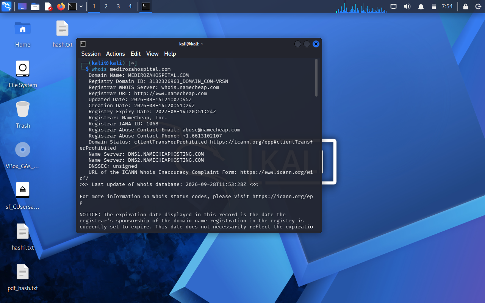
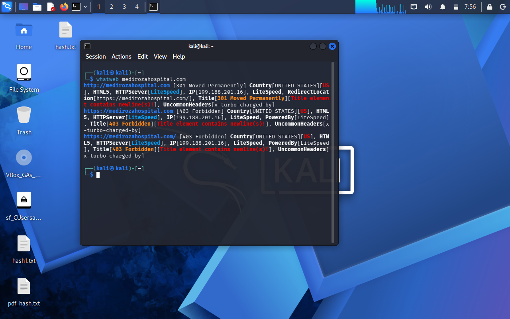
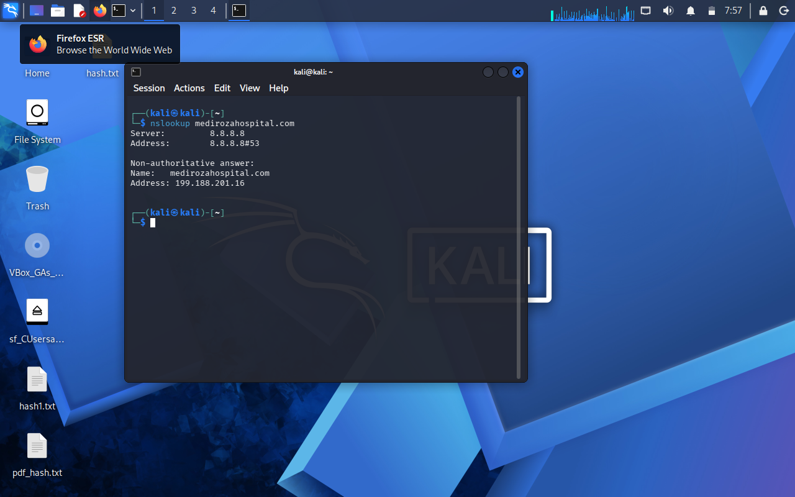
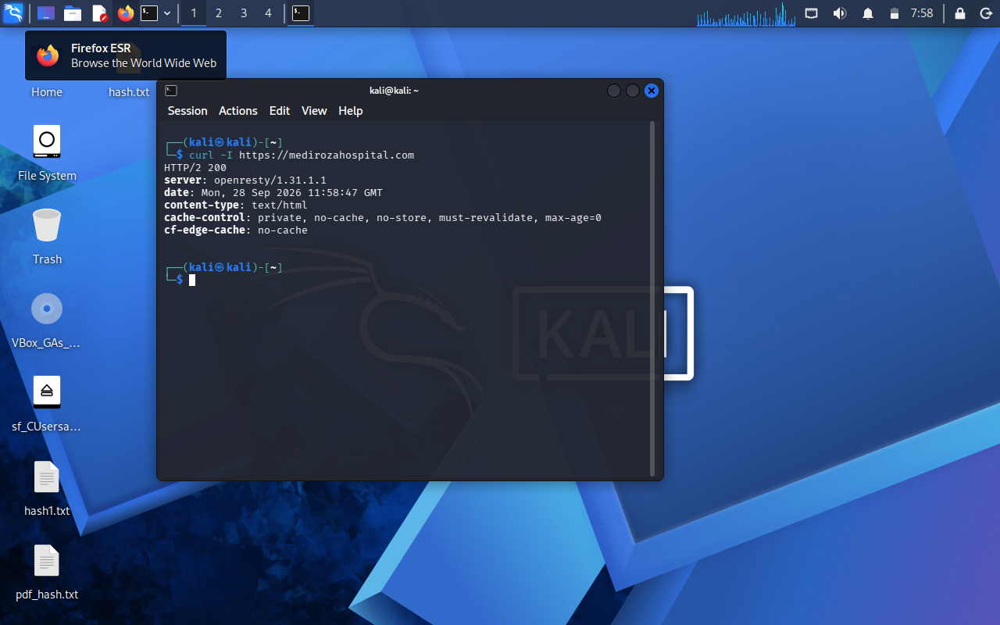
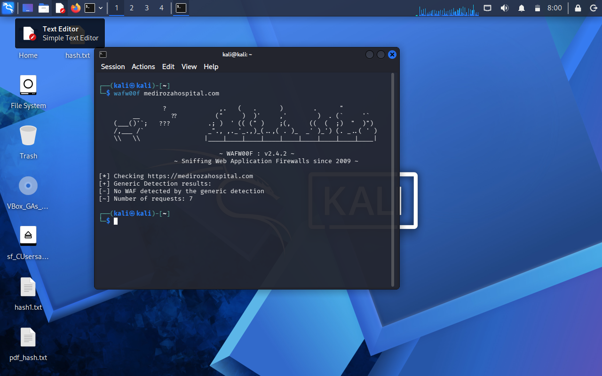
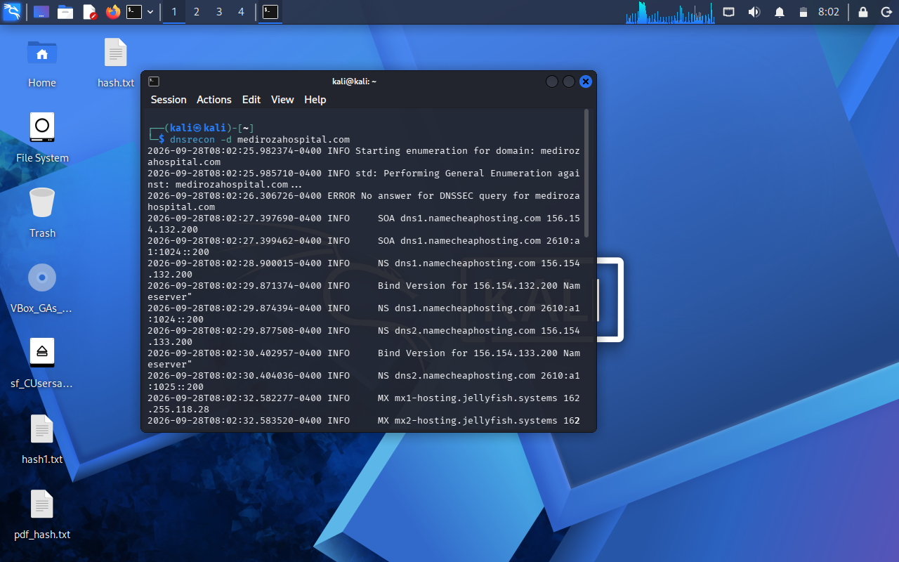
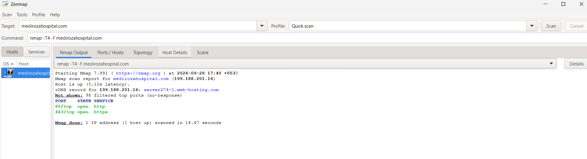
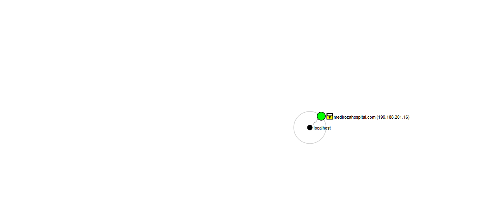

**Directory Listing / Exposed Database Backup**
Risk: Critical

The /old/ directory had directory listing enabled.

The directory exposed a database backup file that was accessible through the web server and exposed critical information related role and finance ,contact info,share holders details etc.

Evidence
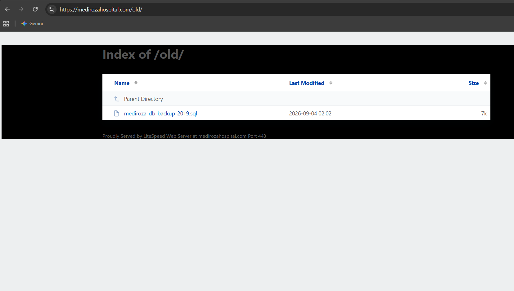
